# BMT / Koperasi Syariah
Aplikasi BMT merupakan aplikasi Baitul Maal Wat Tamwil atau intinya merupakan aplikasi untuk manajemen transaksi pada koperasi syariah

## Persiapan
- PHP 5.6
- Codeigniter 3
- MySql

## Langkah - Langkah
- Clone project
- Buat database contoh: db_bmt
- import database dari file db_bmt.sql

## Screenshot

1. halaman 1
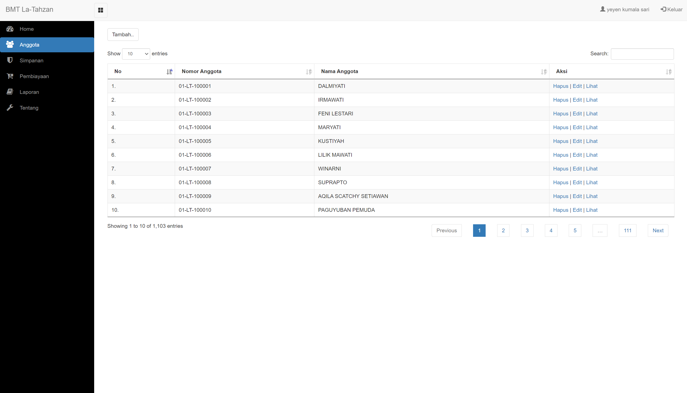

2. halaman 2

3. halaman 3
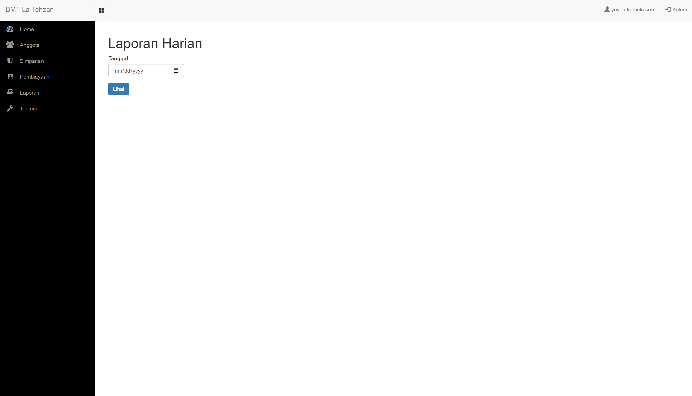

4. halaman 4
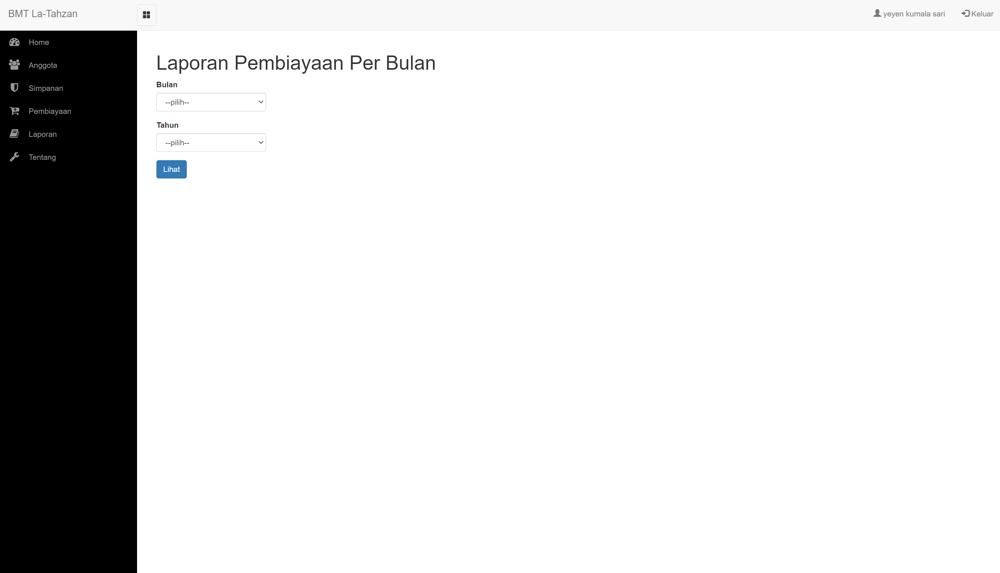

5. halaman 5
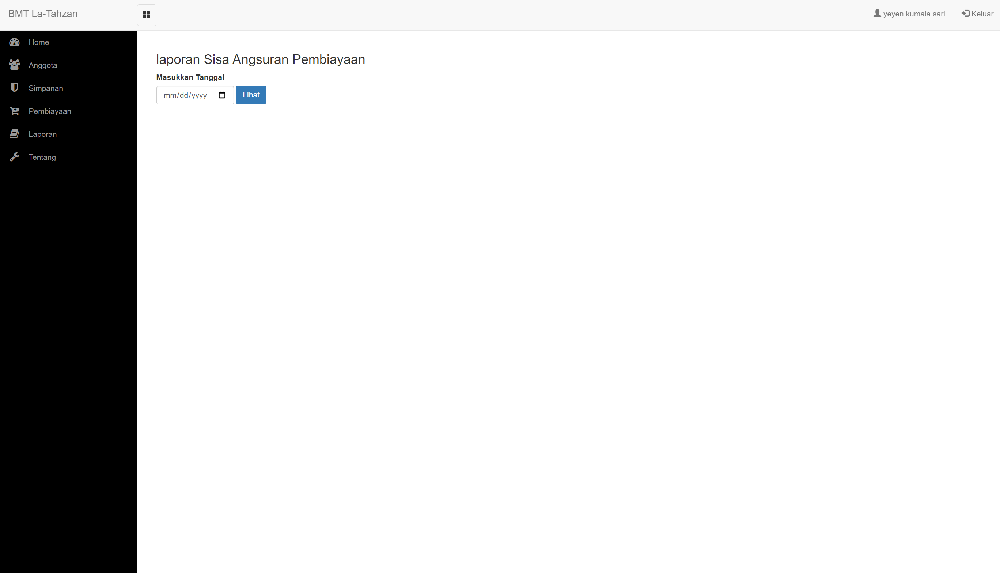

6. halaman 6
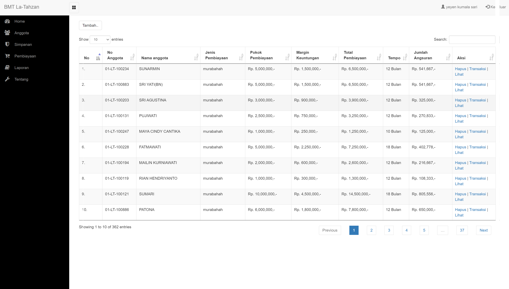

7. halaman 7
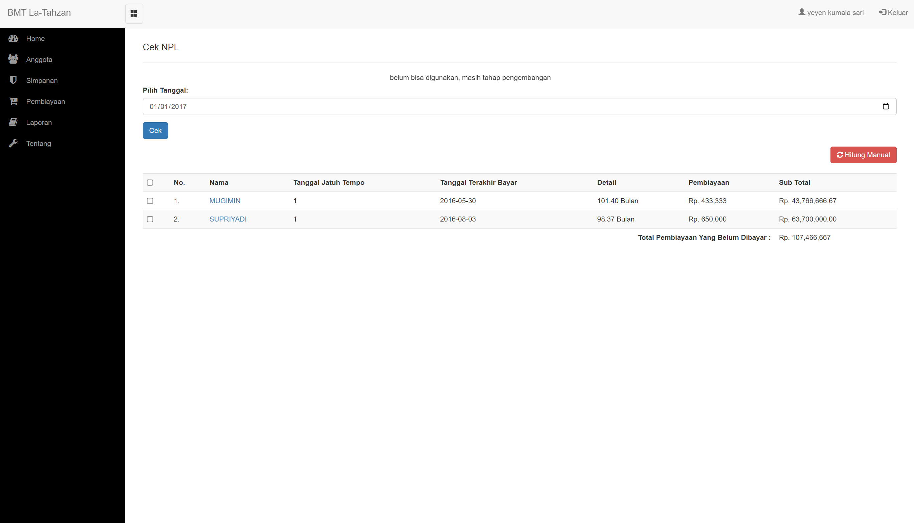

8. halaman 8
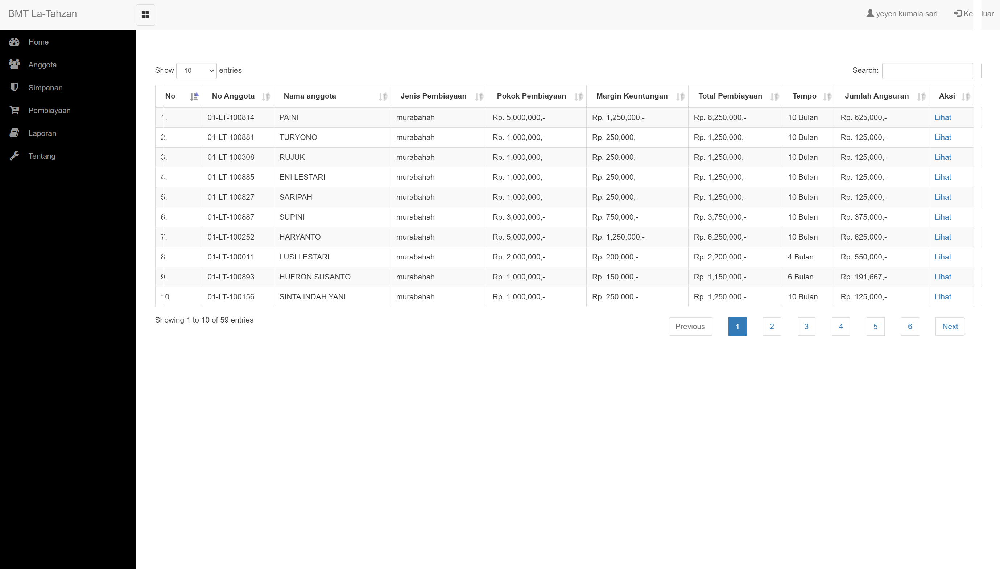

9. halaman 9
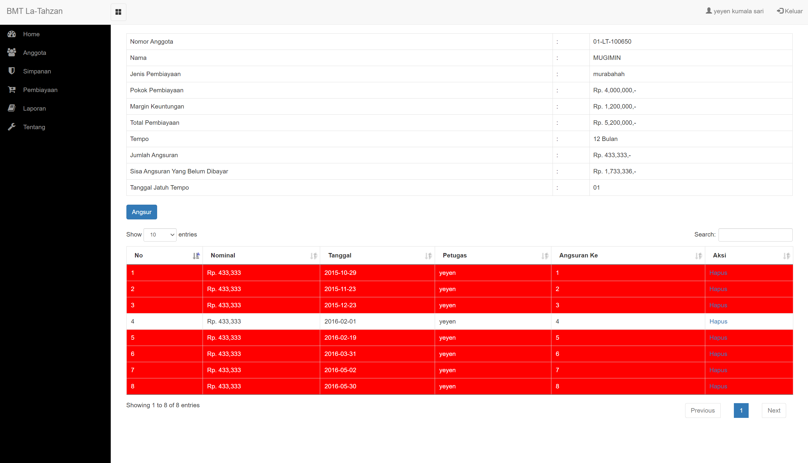

10. halaman 10
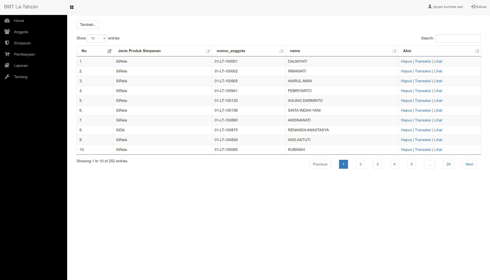

11. halaman 11
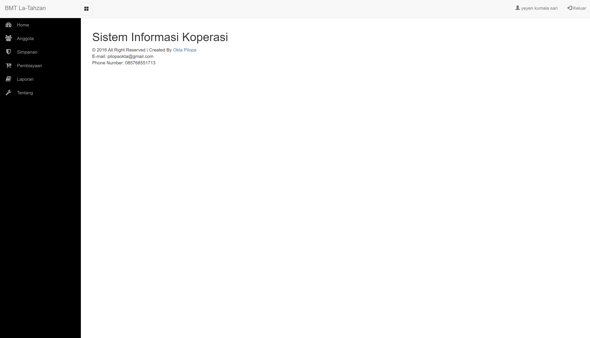

10. halaman 12
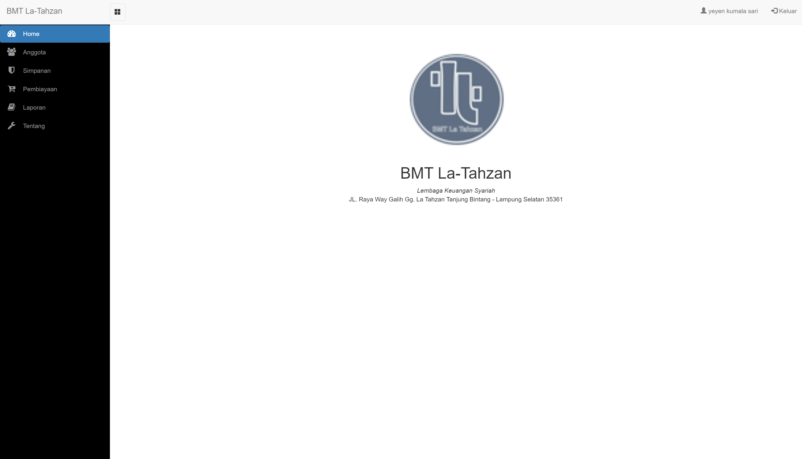

## Penutup
Support saya untuk terus berbagi, dengan mendoakan saya dan keluarga selalu dalam keadaan sehat, diampuni dosa, dimurahkan rejeki, selamat dari siksa kubur, dimudahkan segala urusan, dijamin masuk surga. Amiiin

Jika ingin berbagi sedikit rejeki berikut saya lampirkan akun dana saya 0816564142

Terimakasih !